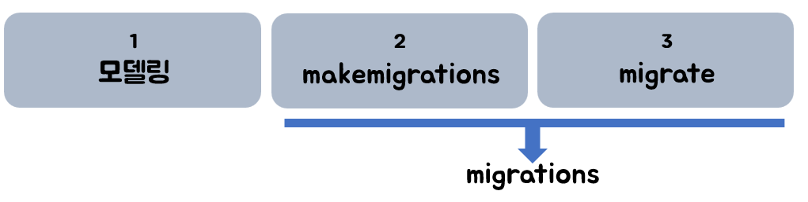

# Migrations

>  **models**

 * MTV 패턴의 M( `DB` 관리 ) 
 * 데이터에 대한 중요한 정보를 제공하는 단일 정보 소스이다. 
 * Each attribute of the model represents a database field.
 * each model maps to a single database table.

`DB` ? 여러 사람이 공유하여 사용할 목적으로 체계화해 통합 관리하는 데이터의 집합


💡 **기억하세요** 💡



`migrations` ? 모델 변경 내역 히스토리 관리 / 모델의 변경사항들을 데이터베이스 스키마에 반영하는 방법


## 1. apps/models.py 모델링

```python
from django.db import models

class Articles(models.Model):
    title = models.CharField(max_length=30)
    content = models.TextField()
```

*  Each field is specified as a class attribute, and each attribute maps to a database column.

  👉 위에 기재된 `CharField`, `TextField` 이외에  `DateTimeField`,  `EmailField` 등등의 [수많은 필드](https://docs.djangoproject.com/ko/2.1/ref/models/fields/#field-types)


## 2. makemigrations

> 모델링한 파일을 실제 DB에 반영 전, 마이그레이션 초안 생성
>

```bash
$ python manage.py makemigrations
```


## 3. migrate

> 해당 마이그레이션 파일을 DB에 반영

```bash
$ python manage.py migrate
```

💡 _**tip !**_   

- django가 기본적으로 활용하고 있는 DB 마이그레이션 파일도 있다.

- 프로젝트 생성과 동시에 `migrate` 를 하자.


> 마이그레이션이 반영되었는지 확인

```bash
$ python manage.py showmigrations
```

* `[ ]` : 적용 전 / `[x]` : 적용 후


