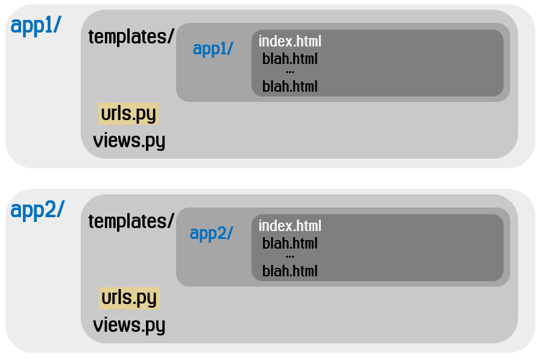

# Multiple app

> web의 각각의 기능(ex)boards, accounts...)을 서로 다른 `app`으로 분리해서 구현/관리한다.


## 1. url 설정 분리하기

> app의 개수나 path가 많아지면 관리하기 힘들기 때문에 각 app 별로 `urls.py` 분리한다. 

*  `project` 폴더의 `urls.py` _  💡 `include`

```python
from django.contrib import admin
from django.urls import path, include
from pages import views

urlpatterns = [
    path('admin/', admin.site.urls),
    
    # variable routing
    path('hi/<str:name>/', views.hi),
    path('add/<int:a>/<int:b>', views.add),
    
    # url 분리
    # url 이 'accounts/'로 시작하면, accounts 앱의 urls.py 로 가서 처리하세요.
    path('accounts/', include('accounts.urls')),
    path('boards/', include('boards.urls')),
]
```


* `app` 폴더의 `urls.py` 

```python
from django.urls import path
# 현재 폴더의 views 를 가져오세요.(하나의 앱 파일 안에 urls.py/views.py 가 있다.)
from . import views

urlpatterns = [
    path('input/', views.input), 	# /app/input/
    path('output/', views.output),	# /app/output/
]
```


#### 💡 유지해야 할 폴더 구조

> django는 templates 파일을 반환하려 아래의 폴더를 탐색한다.
>
> * `DIRS` 에 정의된 경로의 하위 디렉토리
> * `INSTALLED_APPS` 의 `templates` 폴더의 하위 디렉토리
>
> 이 과정에서 중복된 파일이 있는 경우 (ex)`index.html`과 같은) 원치 않는 경과가 나타날 수 있기 때문에,
>
> 👇 아래와 같은 구조를 유지하는것이 좋다.

