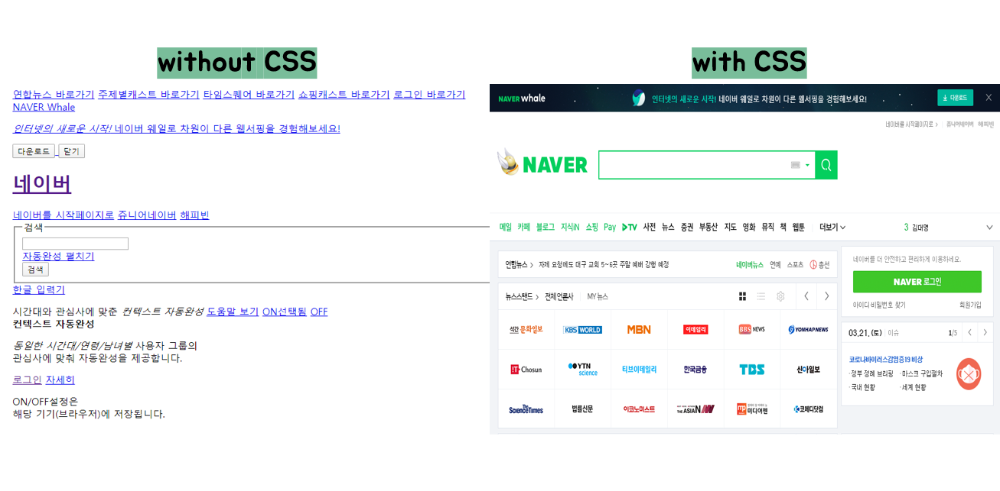

# CSS (Cascading Style Sheets)

> HTML로 `문서의 구조`를 잡았다면, 우리는 CSS로 `문서의 스타일링`을 할 수 있다.

 

### 1. WHY CSS ?

* HTML 요소들이 사용자에게 `어떻게 보여질지` 스타일링이 가능하다.  시각적으로 훨씬 예쁘다.



* HTML과 CSS를 분리해서 효율적인 관리가 가능하다 =>  코드의 `유지보수` 및 `가독성`이 좋아진다.

  

### 2. CSS 기본 문법


```css
/*p태그의 폰트 색상을 빨간색, 굵게, 중앙 정렬해줘*/ 
P {
    color: red;
    font-weight: bold;
    text-align: center;
}
```


### 3. 선택자(SELECTOR)

 `스타일링 하고 싶은 요소`를 특정하여 스타일을 적용하기 위해서 선택자가 필요하다.

```html
<!DOCTYPE html>
<html lang="ko">
<head>
    <meta charset="UTF-8">
    <meta name="viewport" content="width=device-width, initial-scale=1.0">
    <link rel="stylesheet" href="index.css">
    <title>CSS 실습</title>
</head>
<body>
    <div id="wrapper">
        <div id="navigation">
            <h1 id="name">CSS WORLD</h1>
            <ul class="float-right">
                <li><a href="#">ABOUT</a></li>
                <li><a href="#">LOGIN</a></li>
                <li><a href="#">SIGNUP</a></li>
            </ul>
        </div>
    </div>
</body>
</html>
```


* 기본 HTML 태그를 선택할 수 있다.

```css
ul {
    list-style-type: none;
}
```


* `.` 을 사용해 클래스를 가진 요소를 모두 선택할 수 있다.

```css
.float-right {
    float: right;
}
```


* `#` 을 사용해 아이디 값을 가진 요소를 선택할 수 있다.

```css
#name {
    font-size: 24px;
    float: left;
}
```


* `*` 로 전체 요소를 다 선택할 수도 있다.

```CSS
* {
    box-sizing : border-box;
}
```


### 4. CSS 적용

1. 인라인 

   > 스타일을 적용하고 싶은 html 해당 태그에 직접 css를 지정하는 방법

2. 내부 참조

   > html 파일 안, <head> 내부에 <style> 태그 안에서 스타일 지

3. 외부 참조

   > css를 html 밖 다른 파일에 분리/저장하고 `link` 로 html 과 연결하는 방법 


### 🎨 CSS 코드 작성시 도움되는 link 

* Color
  * [Coolors](https://coolors.co/)
  * [Flatuicolors](https://flatuicolors.com/)
* Font
  * [Google Fonts](https://fonts.google.com/)
* CSS animation
  * [Animate.css](https://daneden.github.io/animate.css/)

* Favicon
  * [Favicon generator](https://www.favicon-generator.org/)