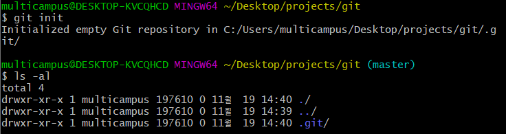
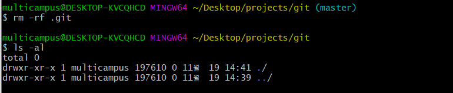
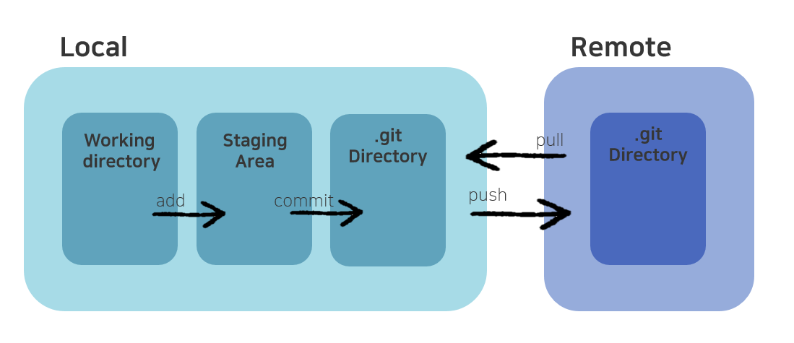

# GIT

> `VCS`(Version Control System 버전관리시스템
>
> Linus Torvalds


#### NOT `delta-based version control` BUT `stream of snapshots`

* delta-based : 각 버전마다 변경된 내용만 가지고 있다. 때문에 버전 변경 시 변경 사항을 추적해 계산하는 데 시간이 오래 걸리고 그에 따른 문제점이 발생할 수 있다. 

* snapshots : 프로젝트의 전체적인 모습을 스냅샷 찍 듯 가지고 있다. 그래서 버전 별로 혹은 브랜치들 사이에서 자유롭게 이동이 가능하다. 변경되지 않은 파일들은 이전 파일의 링크를 가지고 있기 때문에 무겁지 않다. 


#### Why GIT?

* 전세계적으로 `가장 많이 사용`되고 `오픈소스`이며 모든 `동작이 빠르`고, `오프라인`에서도 업무가 가능하다. 뿐만 아니라 실수를 했다면 `빠르게 고칠 수 있`고 `쉽고 빠른 브랜칭`으로 `효율적인 협업`이 가능하다.


* 추천 Terminal
  * Mac : https://www.iterm2.com/
  * Windows : https://cmder.net/
* 추천 Source Tree
  * Source Tree
  * Git Kraken


#### Git 초기화 하고 삭제하기

```bash
# 깃 초기화
$ git init
```



```bash
# 깃 삭제
$ rm -rf .git
```




#### 깃에 대한 다양한 명령어 확인

```bash
$ git config --h
```


#### Git workflow

> git 에는 `working directory`, `staging area`, `.git directory` 로 세가지의 작업 환경이 나뉘어있다.



* working directory

  > 프로젝트를 작업하고 있는 곳, 파일의 수정이 일어나는 공간

  * git 이 알고 있는지 여부에 따라 `untracked`, `tracked` 로 나뉘고, `tracked` 안에서도 이전 버전과 차이가 있는지의 여부에 따라 `unmodified`, `modified` 로 나뉜다.

* staging area

  > "나 버전 히스토리에 저장할 준비가 됐어!" 의 모임

* .git directory(== .git repository)

  > 버전 히스토리를 가지고 있는 장소


## 기본 명령어

* working directory의 파일 상태 확인

```bash
# 상세한 정보 확인
$ git status

# 간단한 정보 확인
$ git status -s
```


* working directory -> staging area 로 옮기기

```bash
# 특정 file 등록
$ git add <file>

# 모든 파일 등록
$ git add *
$ git add .
```


* staging area -> working directory 로 되돌리기

```bash
$ git rm --cashed <file>
```


## git workflow


## stash란

> 아직 stage에 올리지 않을 파일들을 잠시 stash stack에 저장해두어 working directory와 staging area를 비움.

* 다른 브랜치로 옮겨가야하는 상황
* 시도를 저장해둘 때


```bash
$ git stash push -m "first try"
```

```bash
# 내 staging area은 그대로 두고 working directory에 있는 것만 stash 
$ git stash push -m "second try" --keep-index
```

```bash
# 트레킹 되지 않은 애들도 같이 stash에 옮겨
$ git stash -u
```

```bash
# 내 stash 리스트 확인
$ git stash list
```

```bash
# 원하는 stash 정보 보기
$ git stash show <stash id>

# 원하는 stash 정보 자세히 보기
$ git stash show <stash id> -p
```

```bash
# 가장 최근의 stash 빼오기, 목록은 그대로 유지
$ git stash apply

# 원하는 stash 빼오기
$ git stash apply <stash id>
```

```bash
# 가장 최근의 stash 빼오고, 목록에서도 제거
$ git stash pop

# 원하는 stash 제거
$ git stash drop <stash id>

# stash 목록 전체 삭제
$ git stash clear

# stash 적용하면서 새로운 브랜치로 옮겨오기
$ git stash branch <branch name>
```


## 참고 문서

* [Git document](https://git-scm.com/docs)


